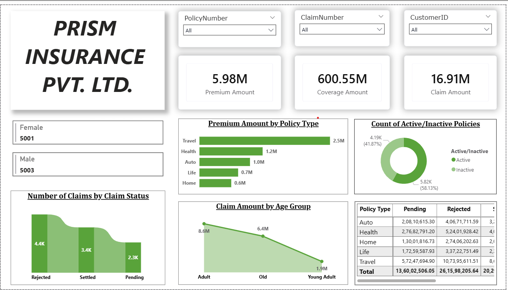
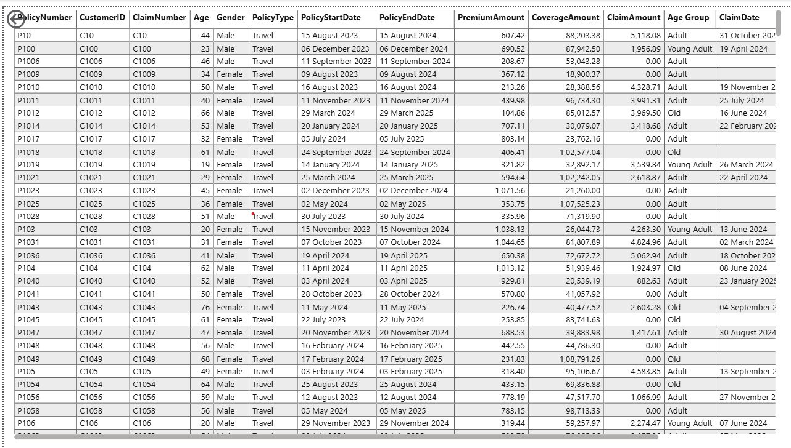
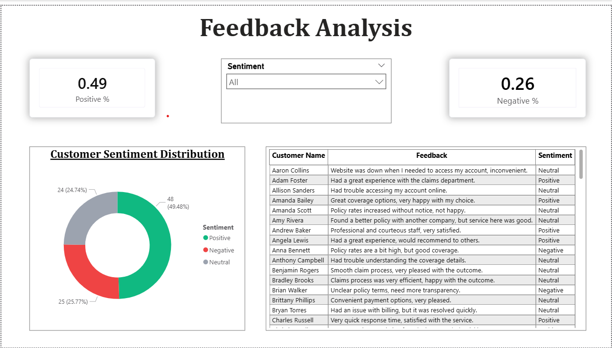

# Insurance Data Analysis Dashboard (Power BI)

## 📊 Project Overview

This project presents an interactive Power BI dashboard designed to analyze insurance data, including premiums, claims, policy performance, customer demographics, and customer feedback. The dashboard provides meaningful business insights through KPIs, visualizations, drill-through analysis, and sentiment analysis to support data-driven decision-making.

---

## 🚀 Key Features

- 📌 KPI Cards for Premium Amount, Claim Amount, and Coverage Amount
- 📊 Interactive dashboard with dynamic filtering and slicers
- 👥 Customer demographic analysis by gender
- 🛡️ Active vs Inactive policy analysis
- 📈 Premium analysis by policy type
- 💰 Claim analysis by age group and claim status
- 🔍 Drill-through analysis by Policy Type for detailed insights
- 💬 Customer feedback sentiment analysis (Positive, Negative, Neutral)
- 🎯 Business insights panel for quick decision-making

---

## ✨ Recent Enhancements

- Redesigned dashboard UI with a modern and professional layout
- Enhanced KPI cards with improved visual hierarchy
- Added business insights section for quick interpretation
- Improved sidebar design and filtering experience
- Optimized dashboard readability and user experience
- Refined chart placement and visual consistency

---

## 🧠 Business Insights

- Travel policies generate the highest premium revenue.
- Active policies account for the majority of total policies.
- Rejected claims exceed settled and pending claims.
- Adults contribute the highest claim amount among all age groups.
- Customer distribution is balanced across genders.

---

## 🛠️ Tools & Technologies

- Power BI
- DAX (Data Analysis Expressions)
- Power Query
- Data Modeling
- Data Visualization

---

## 📂 Dataset

The project uses the following datasets:

- Insurance Data (Policy Details, Premium, Coverage, Claims)
- Customer Feedback Data (Text Feedback for Sentiment Analysis)

---

## 📁 Project Structure

Insurance-Dashboard/

│── Insurance_Dashboard.pbix

│── datasets/

│     ├── insurance_data.csv

│     ├── customer_feedback.csv

│── images/

│     ├── dashboard_overview.png

│     ├── policy_drillthrough_analysis.png

│     ├── customer_sentiment_analysis.png

│── README.md

---

## 📸 Screenshots

### 🔷 Dashboard Overview

### 🔷 Policy Drill-through Analysis

### 🔷 Customer Sentiment Analysis

---

## 📈 Key KPIs

- Total Premium Amount
- Total Claim Amount
- Total Coverage Amount
- Active vs Inactive Policies
- Gender Distribution
- Claim Status Distribution
- Customer Sentiment Distribution

---

## 🎯 How to Use

1. Download the `.pbix` file
2. Open it using Power BI Desktop
3. Explore the dashboard using slicers and filters
4. Analyze policy performance, claim trends, and customer feedback
5. Use drill-through pages for detailed policy insights

---

## 🔄 Future Enhancements

- Power BI Service deployment for online sharing
- Predictive analytics and risk forecasting
- Enhanced customer segmentation

---

## 👨‍💻 Author

**Srihari Donka**

B.Tech - Artificial Intelligence & Data Science  
SRKR Engineering College

### 🔗 Connect With Me

LinkedIn: www.linkedin.com/in/sriharidonka
